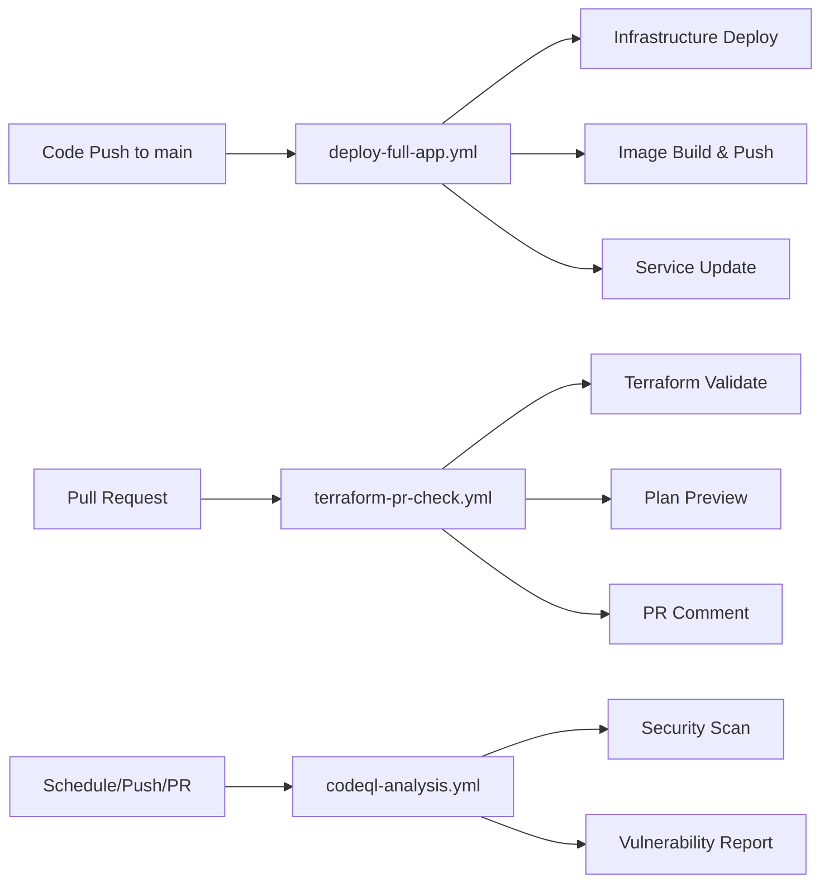

# GitHub Actions Workflows - Optimized Configuration

## 🎯 Overview

This directory contains the streamlined and optimized GitHub Actions workflows for JobQuest Navigator v3 production deployment. All unnecessary workflows have been removed to maintain simplicity and focus.

## 📋 Active Workflows

### 1. **deploy-full-app.yml** - Production Deployment
- **Purpose**: Complete production deployment pipeline
- **Triggers**: 
  - Push to `main` branch (for JNv3 changes)
  - Manual workflow dispatch
- **Stages**:
  1. **Infrastructure Deployment**: Terraform plan & apply
  2. **Docker Image Build**: Build and push to ECR
  3. **Service Update**: Deploy to ECS Fargate
- **Environment**: Production only
- **Features**:
  - ✅ Terraform validation and formatting checks
  - ✅ Remote state management with S3/DynamoDB
  - ✅ Comprehensive error handling
  - ✅ Deployment status reporting

### 2. **terraform-pr-check.yml** - Pull Request Validation
- **Purpose**: Validate Terraform changes in PRs
- **Triggers**: Pull requests to `main` branch
- **Actions**:
  - Terraform format check
  - Terraform validate
  - Terraform plan (no apply)
  - Comment results on PR
- **Benefits**: Prevents invalid infrastructure changes from being merged

### 3. **codeql-analysis.yml** - Security Analysis
- **Purpose**: Automated security code scanning
- **Triggers**: 
  - Push to `main` branch
  - Pull requests to `main` branch
  - Weekly scheduled scan (Monday 6 AM UTC)
- **Languages**: JavaScript, Python
- **Features**: 
  - ✅ Vulnerability detection
  - ✅ Security best practices enforcement
  - ✅ Automated security reporting

## 🗑️ Removed Workflows

The following workflows were removed to simplify the CI/CD pipeline:

- ❌ **deploy-simple.yml** - Redundant with deploy-full-app.yml
- ❌ **manual-deploy.yml** - Functionality merged into deploy-full-app.yml
- ❌ **pr-checks.yml** - Replaced by terraform-pr-check.yml
- ❌ **release.yml** - Not needed for current deployment model
- ❌ **security-comprehensive.yml** - CodeQL provides sufficient security scanning

## 🏗️ Workflow Architecture



## 🔧 Configuration

### Required Secrets
- `AWS_ACCESS_KEY_ID`: AWS access key for deployment
- `AWS_SECRET_ACCESS_KEY`: AWS secret key for deployment

### Environment Protection
- **production**: Manual approval required for production deployments
- Branch protection rules on `main` branch

## 🚀 Deployment Process

### Normal Development Flow
1. **Create Feature Branch** → Make changes
2. **Create Pull Request** → `terraform-pr-check.yml` validates changes
3. **Code Review** → Review Terraform plan in PR comments
4. **Merge to Main** → `deploy-full-app.yml` deploys to production
5. **Security Monitoring** → `codeql-analysis.yml` scans for vulnerabilities

### Emergency/Manual Deployment
1. Navigate to **Actions** tab in GitHub
2. Select **Deploy JobQuest Navigator v3 Production Application**
3. Click **Run workflow**
4. Select **production** environment
5. Click **Run workflow** to start deployment

## 📊 Benefits of Optimization

### ✅ Simplified Management
- Reduced from 8 workflows to 3 core workflows
- Clear separation of concerns
- Easier maintenance and troubleshooting

### ✅ Improved Performance  
- Faster workflow execution
- Reduced resource usage
- Less complex dependency chains

### ✅ Enhanced Security
- Focused security scanning with CodeQL
- Production-only environment protection
- Simplified access control

### ✅ Better Developer Experience
- Clear workflow purposes
- Predictable deployment process
- Comprehensive PR validation

## 🔍 Monitoring & Troubleshooting

### Workflow Status
- **Success**: Green checkmark ✅
- **Failed**: Red X ❌  
- **In Progress**: Yellow dot 🟡

### Common Issues
1. **Terraform Plan Fails**: Check AWS credentials and resource conflicts
2. **Docker Build Fails**: Verify ECR repository permissions
3. **ECS Deploy Fails**: Check security groups and subnet configurations

### Debug Commands
```bash
# Check workflow runs
gh run list --repo kevinhust/CAA900 --limit 10

# View specific run logs  
gh run view <run-id> --log

# Trigger manual deployment
gh workflow run deploy-full-app.yml
```

---

**Last Updated**: $(date)  
**Maintainer**: Claude Code Assistant  
**Environment**: Production Only