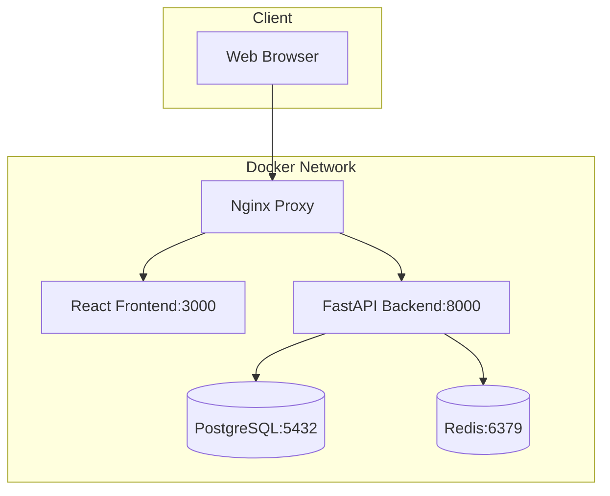

# JobQuest Navigator v2 - Docker Infrastructure

## Overview

Complete Docker-based development environment for JobQuest Navigator v2, featuring:
- **FastAPI + Strawberry GraphQL** backend
- **React** frontend with hot reload
- **PostgreSQL** database with extensions
- **Redis** caching layer
- **Nginx** reverse proxy for production
- **Optional services**: MinIO (S3), MailHog (email testing)

## Quick Start

### Prerequisites
- Docker Desktop 4.0+
- Docker Compose v2.0+
- 8GB+ RAM available for containers

### Start Development Environment

```bash
# Navigate to docker directory
cd infrastructure/docker

# Start all core services
./scripts/start-dev.sh start

# Or with specific profiles
./scripts/start-dev.sh start --with-storage    # Include MinIO
./scripts/start-dev.sh start --with-mail       # Include MailHog
./scripts/start-dev.sh start --minimal         # Core services only
```

### Service URLs (Development)

| Service | URL | Credentials |
|---------|-----|-------------|
| **Frontend** | http://localhost:3001 | - |
| **Backend API** | http://localhost:8001 | - |
| **GraphQL Playground** | http://localhost:8001/graphql | - |
| **Database** | localhost:5433 | jobquest_user / jobquest_password_2024 |
| **Redis** | localhost:6380 | password: jobquest_redis_2024 |
| **MailHog** | http://localhost:8026 | - |
| **MinIO Console** | http://localhost:9002 | minioadmin / minioadmin123 |

## Architecture

### Core Services



### Service Configuration

#### Database (PostgreSQL 15)
- **Image**: `postgres:15-alpine`
- **Database**: `jobquest_navigator_v2`
- **Extensions**: uuid-ossp, pg_trgm, unaccent
- **Persistent**: Yes (named volume)
- **Initialization**: Automatic schema setup

#### Cache (Redis 7)
- **Image**: `redis:7-alpine`
- **Persistence**: AOF enabled
- **Password protected**: Yes
- **Use cases**: Session storage, query caching

#### Backend (FastAPI)
- **Base**: Python 3.11-slim
- **Hot reload**: Enabled in development
- **Health checks**: `/health` endpoint
- **Environment**: Full SQLAlchemy + Strawberry GraphQL

#### Frontend (React)
- **Base**: Node 18-alpine
- **Hot reload**: Enabled via volume mount
- **Proxy**: API calls proxied to backend
- **Environment**: Development optimized

## Development Workflow

### 1. Start Environment
```bash
./scripts/start-dev.sh start
```

### 2. Monitor Logs
```bash
# All services
./scripts/start-dev.sh logs

# Specific service
./scripts/start-dev.sh logs backend
./scripts/start-dev.sh logs frontend
```

### 3. Check Status
```bash
./scripts/start-dev.sh status
```

### 4. Make Code Changes
- **Backend**: Code changes trigger automatic reload
- **Frontend**: Hot reload updates browser automatically
- **Database**: Schema changes via Alembic migrations

### 5. Stop Environment
```bash
./scripts/start-dev.sh stop
```

## Docker Profiles

Use profiles to start different service combinations:

### Default Profile (Core Services)
```bash
docker-compose up -d
# Starts: db, redis, backend, frontend
```

### Storage Profile
```bash
docker-compose --profile storage up -d
# Adds: minio (S3-compatible storage)
```

### Development Profile
```bash
docker-compose --profile development up -d
# Adds: mailhog (email testing)
```

### Production Profile
```bash
docker-compose --profile production up -d
# Adds: nginx (reverse proxy)
```

## Database Management

### Migrations
```bash
# Create migration
docker-compose exec backend alembic revision --autogenerate -m "description"

# Apply migrations
docker-compose exec backend alembic upgrade head

# Check migration status
docker-compose exec backend alembic current
```

### Database Access
```bash
# Connect to database
docker-compose exec db psql -U jobquest_user -d jobquest_navigator_v2

# Backup database
docker-compose exec db pg_dump -U jobquest_user jobquest_navigator_v2 > backup.sql

# Restore database
cat backup.sql | docker-compose exec -T db psql -U jobquest_user jobquest_navigator_v2
```

## Storage Configuration

### MinIO (S3-Compatible)
```bash
# Start with storage profile
./scripts/start-dev.sh start --with-storage

# Access MinIO Console
open http://localhost:9002
# Username: minioadmin
# Password: minioadmin123
```

### File Upload Testing
```bash
# Test S3 operations
docker-compose exec backend python -c "
from app.services.storage import test_s3_connection
test_s3_connection()
"
```

## Debugging

### Container Debugging
```bash
# Shell into backend container
docker-compose exec backend bash

# Shell into frontend container
docker-compose exec frontend sh

# Check container logs
docker-compose logs -f backend

# Check resource usage
docker stats
```

### Health Checks
```bash
# Backend health
curl http://localhost:8001/health

# Database health
docker-compose exec db pg_isready -U jobquest_user

# Redis health
docker-compose exec redis redis-cli ping
```

### Common Issues

#### Port Conflicts
```bash
# Check what's using ports
lsof -i :3001  # Frontend
lsof -i :8001  # Backend
lsof -i :5433  # Database

# Stop conflicting services
./scripts/start-dev.sh stop
```

#### Database Connection Issues
```bash
# Reset database
docker-compose down -v
docker-compose up -d db
```

#### Cache Issues
```bash
# Clear Redis cache
docker-compose exec redis redis-cli FLUSHALL
```

## Production Deployment

### Build Production Images
```bash
# Build optimized images
docker-compose -f docker-compose.yml -f docker-compose.prod.yml build

# Start production environment
docker-compose -f docker-compose.yml -f docker-compose.prod.yml --profile production up -d
```

### Environment Variables
Copy and modify environment files:
```bash
cp .env .env.production
# Edit .env.production with production values
```

## Monitoring

### Service Monitoring
```bash
# Container status
docker-compose ps

# Resource usage
docker stats

# Service logs
docker-compose logs --tail=100 -f
```

### Application Monitoring
- **Backend**: GraphQL introspection at `/graphql`
- **Database**: Query performance via `pg_stat_statements`
- **Redis**: Monitor via `redis-cli monitor`

## Security

### Development Security
- Database password protection
- Redis authentication
- Container user restrictions (production)
- Network isolation

### Production Security
- Non-root container execution
- Secrets management via environment variables
- HTTPS termination at Nginx
- Rate limiting configured

## Backup & Recovery

### Automated Backups
```bash
# Database backup script
./scripts/backup-database.sh

# Full data backup
./scripts/backup-volumes.sh
```

### Recovery
```bash
# Restore from backup
./scripts/restore-database.sh backup-file.sql
```

## Troubleshooting

### Common Commands
```bash
# Reset everything
./scripts/start-dev.sh clean

# Rebuild containers
docker-compose build --no-cache

# Update images
docker-compose pull

# Check disk usage
docker system df
```

### Support
- **Logs**: Check service logs first
- **Health**: Verify all health checks pass
- **Network**: Ensure containers can communicate
- **Resources**: Monitor CPU/memory usage

---

**JobQuest Navigator v2** - Complete Docker development environment with hot reload, automatic health checks, and production-ready configuration.